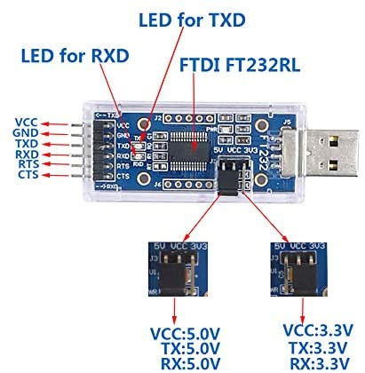

# Jetson-NX-MAVROS-Setup-Guide

## Introduction

This guide serves as tutorial for setting up communation between companion computer (Jetson Xavier NX) using Robotics Operating System and flight controller using PX4 framework. We heavily refered [Companion Computer Setup guide for PX4](https://docs.px4.io/master/en/companion_computer/pixhawk_companion.html), please check the guide for more detailed explanation in each step. 

## Flight Controller Setup

PX4 can connect to companion computers using any configurable serial port. Message are sent over the link using the [MAVLink](https://mavlink.io/en/) protocol.

### Onboard Mode Setup in PX4

To enable flight controller to on-board computer communation, we need to setup [MAVLink Peripherals (GCS/OSD/Companion)](https://docs.px4.io/master/en/peripherals/mavlink_peripherals.html) first. It includes setting the following parameters on QGoundControl:

- [MAV_2_CONFIG](https://docs.px4.io/master/en/advanced_config/parameter_reference.html#MAV_2_CONFIG) = `TELEM 2`
- [MAV_2_MODE](https://docs.px4.io/master/en/advanced_config/parameter_reference.html#MAV_2_MODE) = `Onboard`
- [MAV_2_RATE](https://docs.px4.io/master/en/advanced_config/parameter_reference.html#MAV_2_RATE)= `80000` Bytes/s
- [MAV_2_FORWARD](https://docs.px4.io/master/en/advanced_config/parameter_reference.html#MAV_2_FORWARD) = `True`
- [SER_TEL2_BAUD](https://docs.px4.io/master/en/advanced_config/parameter_reference.html#SER_TEL2_BAUD) = `921600` baud

### EKF Setup in PX4 (for VIO system)

[Extended Kalman filter (**EKF**)](https://en.wikipedia.org/wiki/Extended_Kalman_filter) is a nonlinear version of  [Kalman filter](https://en.wikipedia.org/wiki/Kalman_filter) which linearizes about an estimate of the current mean and [covariance](https://en.wikipedia.org/wiki/Covariance). We rely on EKF to fuse localization information such as Visual Initial Odometry system, barometer, IMU etc. to get pose estimation and publish in `/mavros/local_position/pose`.

Setup in PX4:

- EFK2_AID_MASK = 24
- EFK2_HGT_MODE = VISION

### Serial Port Hardware Setup on Flight Control

PX4 is configured by default to connect to a companion computer connected to the `TELEM 2` serial port.

The following is the location of telemetry 2 port on CUAV Nora Flight Controller.


The wiring configurations are as follows, we need ground (GND), receive (Rx) and transmit (Tx) pins for communication between FC and companion computers.

| TELEM2 |           | FTDI |                        |
| ------ | --------- | ---- | ---------------------- |
| 1      | +5V (red) |      | DO NOT CONNECT!        |
| 2      | Tx (out)  | 5    | FTDI RX (yellow) (in)  |
| 3      | Rx (in)   | 4    | FTDI TX (orange) (out) |
| 4      | CTS (in)  | 6    | FTDI RTS (green) (out) |
| 5      | RTS (out) | 2    | FTDI CTS (brown) (in)  |
| 6      | GND       | 1    | FTDI GND (black)       |

## Companion Computer Setup

### Serial Port Hardware Setup on Companion Computer

#### Method 1 PIN Header

The following is board placement of Jetson Xavier NX Carrier Board (official), see [official spec](https://developer.nvidia.com/embedded/downloads#?search=board%20specification&tx=$product,jetson_xavier_nx) for more information.


You can connect GND, Rx and Tx pins with J12 40-pin Expansion Header or J14 Button Header. On carrier board, each pin is marked for J12 bottom header, for J12 40-pin Expansion Header, you can refer to the figure below for configuration.

**Mind that you should connect Rx from TELEM 2 to TxD on header and Tx from TELEM 2 to RxD on header.**


#### Method 2 USB Serial Port

It is also feasible to use USB serial port for the connection. You can use the configuration below for reference.



### Serial Port Software Setup on Jetson

First, check the existance of your USB device:

```shell
$ dmesg | grep tty
```

This command lists your devices and logs of plug in/out. Without error, you should be able to see `ttyUSB0`.

On Linux the default name of a USB FTDI would be like `\dev\ttyUSB0`. If you have a second FTDI linked on the USB or an Arduino, it will registered as `\dev\ttyUSB1`. To avoid the confusion between the first plugged and the second plugged, we recommend you to create a symlink from `ttyUSBx` to a friendly name, depending on the Vendor and Product ID of the USB device.

Using `lsusb` we can get the vendor and product IDs.

```shell
$ lsusb
Bus 006 Device 002: ID abcd:1234 example device
# in this example, abcd is the vendor id and 1234 is product id.
```

If you do not find your device, unplug it, execute `lsusb`, plug it, execute `lsusb` again and see the added device.

Therefore, we can create a new UDEV rule in a file called `/etc/udev/rules.d/99-Nora.rules` with the following content, changing the idVendor and idProduct with yours.

```shell
sudo echo 'SUBSYSTEM=="tty", ATTRS{idVendor}=="<your idVendor>", ATTRS{idProduct}=="<your idProduct>", SYMLINK+="ttyNora"' >> /etc/udev/rules.d/99-Nora.rule
```

Then, **reboot** Jetson for this to take effect. After this, check `/dev` and see if `ttyNora` is listed.

```shell
$ ls /dev
```

If it is listed, it means the computer will treat your device as `ttyNora` instead of default `ttyUSB0` or others.

Finally, add yourself in the `tty` and `dialout` groups via `usermod` to avoid to have to execute scripts as root.

```shell
$ usermod -a -G tty username
$ usermod -a -G dialout username
```

## Verify MAVLink Comunication Messages

Till this point, flight controller and onboard computer are able to communicate with each other. We can use [MAVROS](http://wiki.ros.org/mavros)

to check the messages published in ROS topics by `mavros` node.

First, install MAVROS in case you haven't, note that this script installs a binary version.

```shell
$ sudo apt-get install ros-<ur distro>-mavros ros-<ur distro>-mavros-extras
```

Then install [GeographicLib](https://geographiclib.sourceforge.io/)datasets by running the `install_geographiclib_datasets.sh` script:

```shell
$ wget https://raw.githubusercontent.com/mavlink/mavros/master/mavros/scripts/install_geographiclib_datasets.sh
$ sudo bash ./install_geographiclib_datasets.sh   
```

Before launching, we need to modify the default device name to `ttyNora` in its launch file `px4.launch`. To find `px4.launch`:

```shell
$ roscd mavros
$ cd launch
```

After this, you can check communation setup by:

```shell
$ roslaunch mavros px4.launch
```

If there's no errors, you can see multiple mavros topics published by 

```shell
$ rostopic list
```

And check state:

```shell
$ rostopic echo /mavros/state
```
